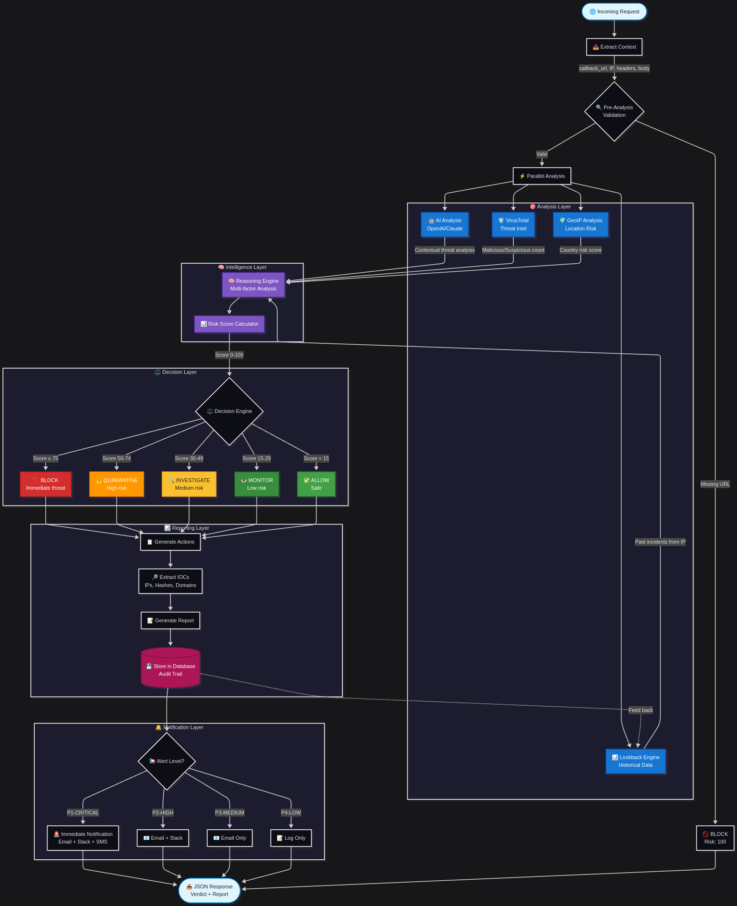

# 🛡️ Cibersecurity Agent

A modular cybersecurity agent built with Django and Python.  
It acts as a proxy, intercepting HTTP requests, analyzing them with AI and threat intelligence, and storing results for future audits and learning.

## Features

- Proxy endpoint for request interception and analysis
- AI-powered contextual threat analysis (OpenAI, Claude, etc.)
- VirusTotal integration for threat intelligence
- Historical lookback engine
- GeoIP risk analysis
- Multi-factor reasoning and risk scoring
- Automated decision engine (BLOCK, QUARANTINE, INVESTIGATE, MONITOR, ALLOW)
- IOC extraction and reporting
- Notification system (Email, Slack, SMS)
- Audit trail and database storage

## Pipeline Overview



> The full pipeline is described in [docs/pipeline.mmd](docs/pipeline.mmd).  
> You can edit and export the diagram using [Mermaid Live Editor](https://mermaid.live).

## Folder Structure

```text
cibersecurity-agent/
├── api/
├── core/
├── docs/
│   └── pipeline.mmd
│   └── pipeline.png
├── README.md
├── pyproject.toml
└── .env
```
